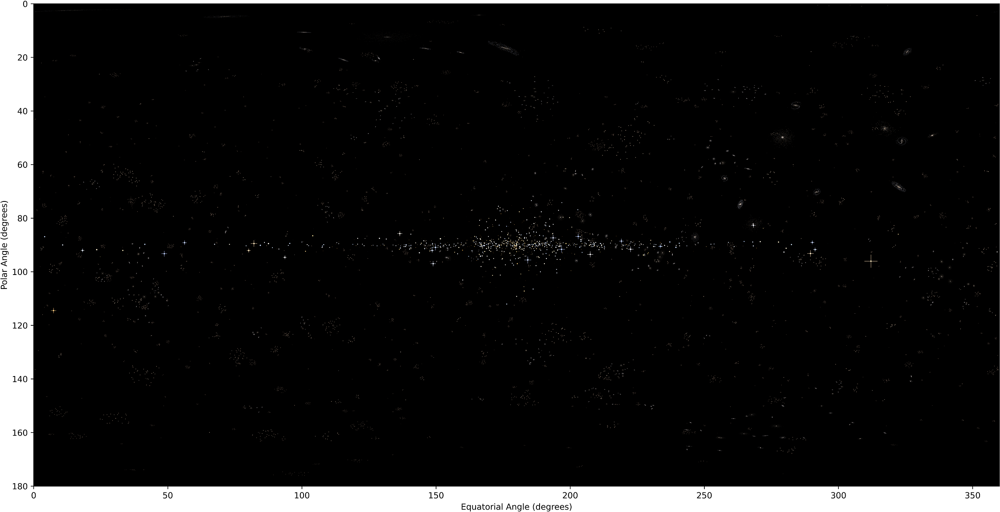
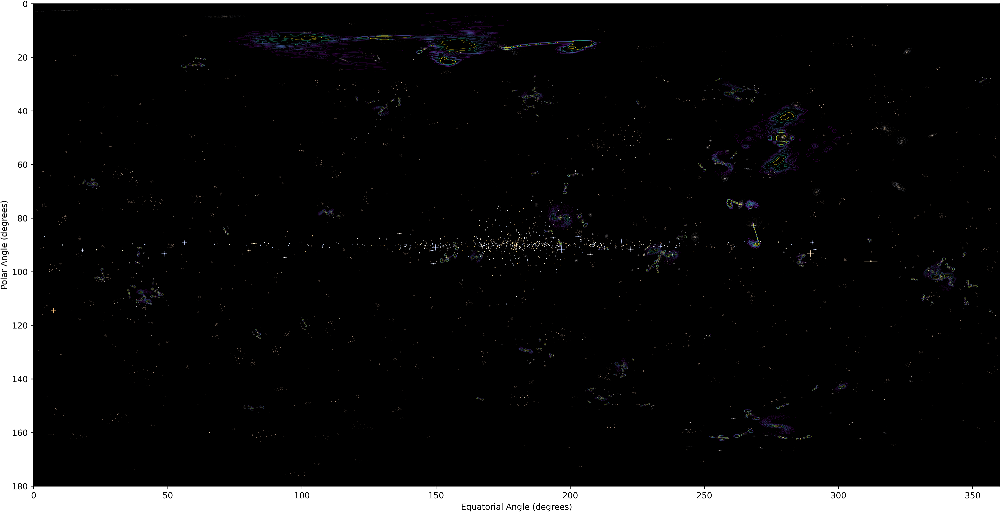

## To start off...
This simulation was programmed in Python and it was designed with analysis in Python in mind. Of course, you can use any language you'd like to look at and analyse the data.

I've included a [(WIP) walkthrough](Walkthrough/introduction.md) in how to analyse the data. With that in mind, there are countless different ways that you could look at and analyse the data, all of which having pros and cons. 

## What you can find
In principle, and with enough effort, you could find most of if not all of the physics that is simulated in this program. Below is a non-exhaustive list of what you could determine:

??? note "Stars:"
	 - Star temperatures
	 - Star Radii
	 - Star bolometric luminosities
	 - Star masses (*big* maybe on this one)
	 - Stellar variability periods (for those stars which have variable light curves)
	    - Period-Luminosity function for variable stars
	 - Stellar populations on a HR diagram
??? note "Galaxies:"
	 - Galaxy classification
		- Do different classes have different colour/luminosity?
		- Are there different populations of stars in different areas of a galaxy?
	 - Galaxy rotation curves
		- Do galaxies have black holes?
			- Do black holes have radio emission? Does radio emission depend on galaxy type?
			- How massive are the black holes?
		- Do galaxies have dark matter?
??? note "Galaxy clusters:"
	 - How many galaxies are in clusters?
	 - Galaxy cluster rotation curves
		- Do galaxy clusters have dark matter?
	 - Galaxy type vs position in the cluster?
??? note "Universe overall:"
	 - What is the hubble constant? (**_this is the main goal of analysis!_**)
	 - Where are supernovae/flashes? How often do they occur? What is their intrinsic brightness?
	 - Is the universe homogeneous and/or isotropic? 
	 - Are galaxies the same colour at any distance?
	 
### How you can find it:

## What's inside the data...

When opening the dataset folder, you'll be greeted by a few files all of which are relevant to working out properties of the universe within. Let's look at the dataset with seed 588.

### `Universe Image.png`
A good first point to start is with `Universe Image.png`. 

Straight away we can see via the $x$ and $y$ axes that this is a full sky image. The data is given in a spherical coordinate system, with a polar angle of 0 at the north pole and 180 at the south pole. The equatorial angle of 180 degrees is effectively 'straight ahead' (although it really doesn't matter much), with 270^o^ being to the right, 90^o^ being to the left and 0 and 360^o^ being 'behind'. 

Lets take a bit of a closer look at the image, specifically zooming in at about a polar angle of 90^o^ and an equatorial angle of 200^o^.

This image shows most of the main features of `Universe Image.png`:

 - There are some very bright stars that have diffraction spikes.
 
 - There are many resolved but dimmer stars in our own galaxy (meaning they have no diffraction spikes). 
 These seem to be aligned more or less in a disk going about the center of the image horizontally.
 
 - There are some resolved clusters of stars in the distance: galaxies!
 
 - There are very very distant objects in some parts of the image. The most easily seen is in the bottom, slightly right of center. These are distant galaxies that are too far to resolve individual stars or structure.
 
Even with just this image alone, you can start qualitatively saying some things about this universe. 

### `Radio Overlay Image.png`
Next, let's take a look at the radio overlay image.

At first glance, this is extremely similar in layout and appearance to the `Universe Image`; that's because it is! As part of the 'data collection' of this universe, some imaging was done in the radio portion of the spectrum and has been overlaid onto the visible spectrum image. Let's take a closer look (specifically at about polar=130^o^ and equatorial=190^o^).

This is a _very_ zoomed in image, and so there are limitations both on the image resolution _and_ the radio resolution. With that said, we can clearly see some radio features in the space around some (but not all!) galaxies. What's caused this? Why are there some different looking radio lobes? 

### `Radio Source Data.txt`
Looking at the radio images above, it seems that the radio features eminate from the centers of some galaxies. These radio sources are the brightest parts of the radio features, and were imaged with a full-spectrum (but low resolution) imager so that the source of these radio features could have a rough estimate of its _bolometric_ luminosity (that is, luminosity across the whole spectrum). 

On opening the file, you'll see some data that has the headings:

 Measurement | Unit | Explanation
 --- | --- | ---
 Equatorial | degrees | Equatorial angle of the radio source
 Polar | degrees | Polar angle of the radio source
 Luminosity | W/m^2^ | Approx. bolometric luminosity of the radio source
 
The bolometric luminosity imager is only accurate to luminosities of 10^-17^ W/m^2^ or higher. All other sources are not included in the data file.

### `Star Data.txt`
Arguably the most important of the files is the star data file. Each _**resolved**_ star in the universe has a line of data in this file. Measured is the stars position, its monochromatic (meaning one colour) luminosity for three wavelengths (using a highly sensitive instrument), parallax angle, radial velocity and a light curve (if the star is characterised by a variable luminosity). 

 Measurement | Unit | Explanation
 --- | --- | --- 
 Equatorial | degrees | Equatorial position of the star
 Polar | degrees | Polar position of the star
 BlueF | W/nm/m^2^ | Monochromatic luminosity of the star at 440nm
 GreenF | W/nm/m^2^ | Monochromatic luminosity of the star at 500nm
 RedF | W/nm/m^2^ | Monochromatic luminosity of the star at 700nm
 Parallax | arcseconds | Maximum parallax angle of the star across 1 year of observations
 RadialVelocity | km/s | Line-of-sight motion of the star (positive implies motion away)
 Variable? | N/A | 1 if the star shows variability in its luminosity, 0 otherwise.

### `Variable Star Data`
Some stars in the universe will have a variable luminosity across time, and so this variability was measured if applicable and saved in a separate file for each star in the format `{starname}.txt`. The luminosity of the star was measured once every hour for 120 hours, and data is given in terms of a proportion of its average luminosity. 

 Measurement | Unit | Explanation
 --- | --- | --- 
 Time | hours | The time (since starting) of the measurement
 NormalisedFlux | N/A | Proportion of baseline (average) luminosity

### `Distant Galaxy Data.txt`
Due to their small size in the sky, distant galaxies could be measured using the same instruments as those used to measure star properties. 

 Measurement | Unit | Explanation
 --- | --- | --- 
 Equatorial | degrees | Equatorial position of the galaxy
 Polar | degrees | Polar position of the galaxy
 BlueF | W/nm/m^2^ | Monochromatic luminosity of the galaxy at 440nm
 GreenF | W/nm/m^2^ | Monochromatic luminosity of the galaxy at 500nm
 RedF | W/nm/m^2^ | Monochromatic luminosity of the galaxy at 700nm
 Size | arcseconds | The width in the sky subtended by the galaxy
 RadialVelocity | km/s | Line-of-sight motion of the galaxy (positive implies motion away)

### `Supernova Data.txt`
Across the period of observation (1 year), several extremely bright flashes were observed that faded away within a few weeks. This was measured with the rough bolometric luminosity imager.

 Measurement | Unit | Explanation
 --- | --- | --- 
 Equatorial | degrees | Rough position of the bright flash
 Polar | degrees | Rough position of the bright flash
 PeakFlux(W) | W/m^2^ | Rough bolometric luminosity of the bright flash