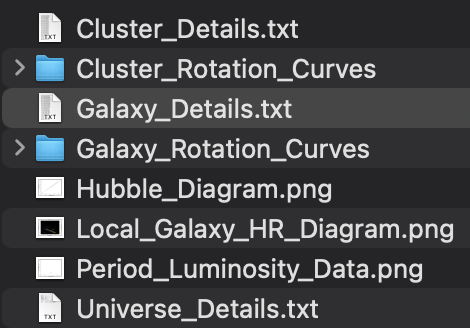

# Datasets
 
Each group has a different Universe to work with, but note that they don't necessarily have the same properties!

At the first lab, you were assigned into 12 groups. You are welcome to change if you feel a pressing need but if so _please_ tell the lecturer immediately over email.

Here are your datasets, in interactive webpages and in zip files you can download containing everything:

- Group 1: [web](https://people.smp.uq.edu.au/BenjaminPope/PHYS3080/universe_1/), [zip](https://people.smp.uq.edu.au/BenjaminPope/PHYS3080/universe_1.zip) 
- Group 2: [web](https://people.smp.uq.edu.au/BenjaminPope/PHYS3080/universe_2/), [zip](https://people.smp.uq.edu.au/BenjaminPope/PHYS3080/universe_2.zip) 
- Group 3: [web](https://people.smp.uq.edu.au/BenjaminPope/PHYS3080/universe_3/), [zip](https://people.smp.uq.edu.au/BenjaminPope/PHYS3080/universe_3.zip)
- Group 4: [web](https://people.smp.uq.edu.au/BenjaminPope/PHYS3080/universe_4/), [zip](https://people.smp.uq.edu.au/BenjaminPope/PHYS3080/universe_4.zip)
- Group 5: [web](https://people.smp.uq.edu.au/BenjaminPope/PHYS3080/universe_5/), [zip](https://people.smp.uq.edu.au/BenjaminPope/PHYS3080/universe_5.zip)
- Group 6: [web](https://people.smp.uq.edu.au/BenjaminPope/PHYS3080/universe_6/), [zip](https://people.smp.uq.edu.au/BenjaminPope/PHYS3080/universe_6.zip)
- Group 7: [web](https://people.smp.uq.edu.au/BenjaminPope/PHYS3080/universe_7/), [zip](https://people.smp.uq.edu.au/BenjaminPope/PHYS3080/universe_7.zip)
- Group 8: [web](https://people.smp.uq.edu.au/BenjaminPope/PHYS3080/universe_8/), [zip](https://people.smp.uq.edu.au/BenjaminPope/PHYS3080/universe_8.zip)
- Group 9: [web](https://people.smp.uq.edu.au/BenjaminPope/PHYS3080/universe_9/), [zip](https://people.smp.uq.edu.au/BenjaminPope/PHYS3080/universe_9.zip)
- Group 10: [web](https://people.smp.uq.edu.au/BenjaminPope/PHYS3080/universe_10/), [zip](https://people.smp.uq.edu.au/BenjaminPope/PHYS3080/universe_10.zip)
- Group 11: [web](https://people.smp.uq.edu.au/BenjaminPope/PHYS3080/universe_11/), [zip](https://people.smp.uq.edu.au/BenjaminPope/PHYS3080/universe_11.zip)
- Group 12: [web](https://people.smp.uq.edu.au/BenjaminPope/PHYS3080/universe_12/), [zip](https://people.smp.uq.edu.au/BenjaminPope/PHYS3080/universe_12.zip)

## How to Access and Use the Data

The first step in analysing the data is to get the data! Download one of the .zip files from above according to your group number and unzip it in a directory you'd like to work in. You can also use the html interface to navigate the data and pictures of your new universe!
<!-- Upon unzipping the file, you will see these files, or files similar to this:

 -->
With these files downloaded, you can now start analysing the data. Taking a look at the Tutorials section may be a good spot to start!